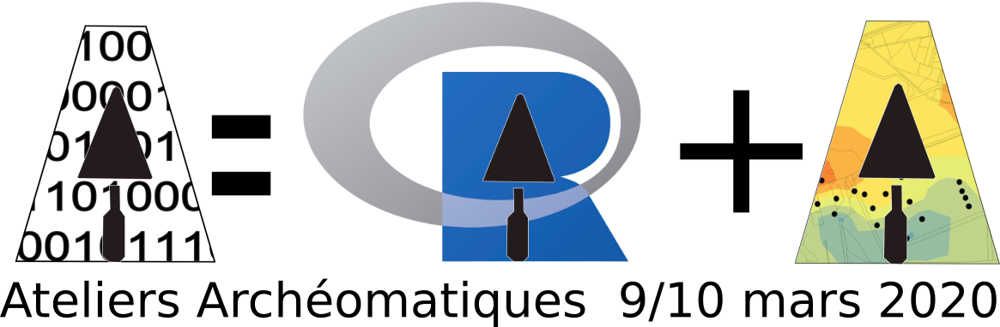

## AA2020.1: Méthodes d’interpolations appliquées aux données archéologiques avec R : exemple d’application du krigeage.

9-10 mars 2020 - Amélie Laurent-Dehecq (CD45/CITERES-LAT) &amp; Sylvain Badey (INRAP/CITERES-LAT)

## Supports en ligne :

*  la présentation sur [slides.com](https://slides.com/archeomatic/aa20_krigeage)

*  la page des ateliers archéomatiques sur le [site du réseau ISA](http://isa.univ-tours.fr/spip.php?article386)

* les données et  supports écrits sur [github](https://github.com/archeomatic/AA2020.1)

## Présentation:

*Modéliser une surface à partir de données  ponctuelles est possible à l’aide des SIG. Il existe plusieurs méthodes  d’interpolation spatiale qui ont leurs avantages et leurs inconvénients. La méthode du krigeage, méthode probabiliste (géostatistique), est la  plus objective car elle permet de prendre en compte la distribution  spatiale de la variable étudiée dans le calcul de l’interpolation.*

Cette méthode comprend plusieurs étapes qui seront présentées lors de l’atelier :

-  définir la variable à interpoler (ex : épaisseur  du dépôt archéologique, toit du substrat naturel…) et structurer les  données au sein d’un SIG
-  étudier la structuration spatiale des  données à l’aide de l’analyse d’un variogramme (définition des  paramètres pour réaliser le krigeage)
-  réaliser l’interpolation spatiale et représentation des résultats (sémiologie graphique et export des données).

L’atelier sur 2 jours est organisé en trois temps :

1er jour:

-  Une prise en main des logiciels R et Rstudio.
-  Une présentation des principes, des méthodes et de leur mis en œuvre à  l’aide du logiciel R (analyse variographique) et du logiciel QGIS (SIG).

2ème jour:

-  Une application sous forme d’atelier collaboratif à partir des données  apportées par les participants (ou un jeu de données fournit par  l’intervenant) suivi d’un débat.

## Citation:

Amélie Laurent-Dehecq et Sylvain Badey. Atelier Archéomatique 20.1 : Méthodes d’interpolations appliquées aux données archéologiques avec R : exemple d’application du krigeage. École thématique. Les Ateliers Archéomatiques, MSH Val de Loire, France. 2020.